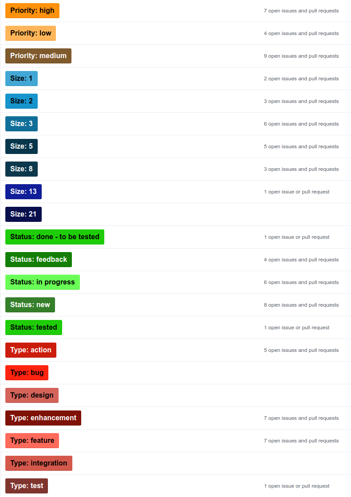

# project-management
Explanation of how are managed the Sinapse projects based on github repositories. The management will as agile as possible

# Overview

Due to the complexity of the projects and the worldwide ressources involved in the development it is necessary to implement an agile project management system in order to get the work done in a sustainable way. 

It will be implemented a kind of SCRUM management system that will be very basic at first and then will be growing in complexity if it required. 

# Building blocks

The management system is based in the following blocks or pillars

## Roles

### Product Owner

Responsible of the product, project or development. It is the responsible of the global design of the product and the priorities. He can change the priorities but with the consent of the Scrum Master

### Scrum Master

Responsible of the technical design and the division into tasks, supervise the development and the correct execution of the tasks. 
Set the tasks into Sprints (with the help of the developers) and plan and manage all the required meetings

### Developers

Responsible of the tasks development and basic testing following priorities and estimating the effort. They can change the size of a task after speak with the Scrum Master. They should finish all the taks planned in a Sprint or inform about possible problems as soon as possible.

## Wiki

The documentation of the project will be written in the wiki of the repository. The Wiki is like a functional requirements + technical requirements dossier. 

In the wiki it is explained the global view of the project to be developed, then the concrete work to do will be explained in the tasks

## Tasks / Issues

They are the base of any development project. Any kind of development will be splitted in simple tasks in order to ease the development and also the planification and management of the features. The tasks should be as simple as possible, if a task is very extense or complicated they should be devided into several more simple tasks: Divide and Conquer!

Each task contains always minimum 4 labels providing *Type*, *Priority*, *Size* and *Status*

**Type**: Indicates what kind of task is, like bug, feature, design or enhancement. Set by the Scrum Master

**Priority**: There are three priorities: Low, Normal and High. If a developer has several tasks assigned in the same milestone, it should focus at first in the High priority tasks. Set by the Product Owner and Scrum Master

**Size** or story points: It is a relative measurement related with the complexity and necessary time to be invested in order to finish it. It is a tool that try to ease the stimation. To stimate using time is not very exact and normally the stimations never works. The sizes normally maps a interval of time, but not always. Set by the Scrum Master and Developers

**Status**: Indicates how is the task at the current moment. Set by Scrum Master and Developers

### Labels

### Management of the Issues

TODO

## Milestones and Sprints

As above explained, the development it is divided into tasks and this tasks will be grouped in Milestones. There are two types of Milestones:

- Backlog: Contains all the tasks planned but not finished nor assigned to any Sprint
- Sprint [WX]: Contains the tasks to be developed during a given Sprint

### Sprint Basics

* Timeframe : 2 Weeks. Start at Monday and finish on Friday
* Name convention: Sprint [WX YEAR], where X is the number of the week when the Sprint finishes
* Tasks: Contains N tasks that where in the backlog and should be finished in the current Sprint. If any task is not finished during the Sprint return to the backlog. All the tasks finished remain in the Sprint easing the retrospective
* Size of the Sprint: The size represents the addition of the tasks size assigned to the Sprint. This size depends of the number of developers working on the Sprint and their availability. The size should be as maximum equal to NumberOfDevelopers * 21
* Developer Effort: By default, a full time developer could finish **21** points in each Sprint. 

### Sprint Meetings

* Sprint planning: Friday before the beginning date of the Sprint 
* Sprint review: Last Thursday of the current Sprint

Example: For Sprint [W4 2018], Sprint Planning was Friday of W2 and the Sprint Review was the Thursday of the W4

# External ressources

https://codetree.com/guides/sprint-planning-github-issues

https://github.com/jvandemo/github-scrum-workflow

https://medium.com/@dtinth/how-to-copy-github-labels-from-one-project-to-another-1857adc73e0f

https://www.mitchlacey.com/
